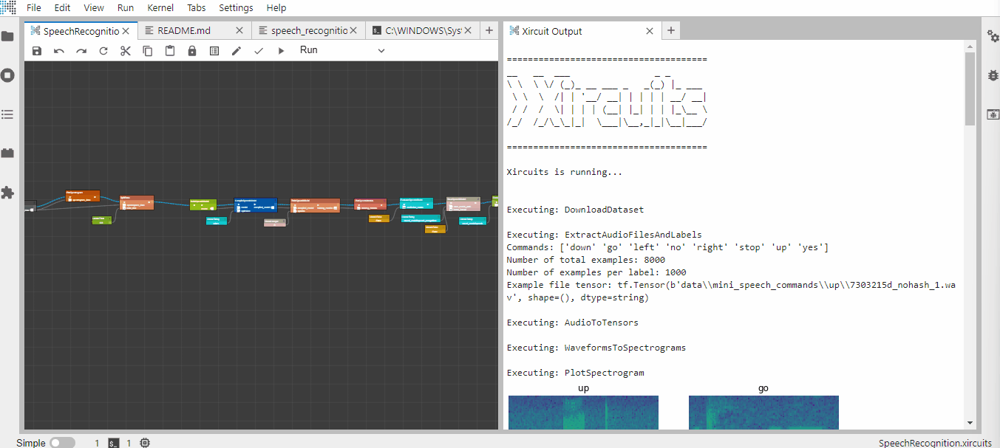
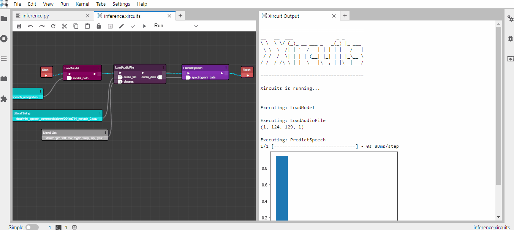

# Xircuits Project Template

This template allows you to train a Tensorflow speech recognition model, using a mini version of the [speech_commands dataset](https://www.tensorflow.org/datasets/catalog/speech_commands).

It consists of the components listed below:

- Dataset preparation: this section handles the dataset used in this template through multiple components.

  - `DownloadDataset` : Mini version of speech commands dataset.
  - `ExtractAudioFilesAndLabels` : Extract the audio files from each folder & labels from the folder's name.
  
- Preprocessing dataset: Preparing dataset to be fed into the model.
  - `AudioToTensors` : Decode the audio .wav file into waveforms.
  - `WaveformsToSpectrograms` : Convert the waveforms to spectrogram to be fed into the model.
  - `PlotSpectrogram` : Visualize spectrogram.
  - `SplitData`: Split the dataset into training, validation and testing set.

- Model training: build and compile the model for training.
  - `BuildSpeechModel` : building a simple network model.
  - `CompileSpeechModel` : compile the model with the chosen optimizer.
  - `TrainSpeechModel` : training and validating the model with the defined epoch number.
  - `PlotSpeechMetrics` : evaluate training performance, by plotting the training loss and accuracy against the number of training epochs.
  - `EvaluateSpeechModel` : determine the model accuracy based on the testing dataset, and able to view the confusion matrix.
  - `SaveSpeechModel` : save model in keras or tensorflow format.
  - `ConvertSpeechTFModelToOnnx` : convert TF model to onnx model to be used in other platforms.
  
- Inference components: To predict the text of the speech from an audio file.
    - `LoadModel` : Load the trained Tensorflow model.
    - `LoadAudioFile` : Load an audio file and preprocess for prediction.
    - `PredictSpeech` : Predict the text.
  
## Prerequisites

You will need Python 3.9+.

## Installation

1. Clone this repository
2. Create virtual environments and install the required python packages.

```
pip install -r requirements.txt
```

3. Run xircuits from the root directory

```
xircuits
```

## Workflow in this Template

#### SpeechRecognition.xircuits

- In this template, we used the perform a simple speech recognition. You can further fine tune the model by modifying the hyperparameters.



## Inference.xircuits

- Predicts the speech from an audio file and outputs the probability of the prediction. 



## Future work

1. Perform inference using [Silero models](https://github.com/snakers4/silero-models).
2. Train model on [complex speech dataset](https://www.tensorflow.org/datasets/catalog/librispeech).